# Informe de Laboratorio 6 — ToDo Full Stack

## 1. Integrantes
- [Tu nombre completo]
- [Nombres de tus compañeras de equipo]

## 2. Repositorio
https://github.com/DOSW-2026-2/Lab6-G4-AppToDo

## 3. Descripción de la solución
Aplicación ToDo full stack con backend en Spring Boot (Java 21, Spring Boot 3.3.4),
persistencia en PostgreSQL ejecutado en Docker, y frontend en React con Vite.
El backend expone una API REST en `/api/v1/tasks` con operaciones CRUD completas,
validación de datos y manejo centralizado de errores. El frontend consume esa API
y permite crear, listar, editar, cambiar estado y eliminar tareas.

## 4. Arquitectura final
```
React (Vite) → fetch (taskApi.js) → REST Controller → Service → Repository
→ JPA/Hibernate → PostgreSQL (Docker)
```
- **Controller**: expone los endpoints HTTP y traduce peticiones/respuestas.
- **Service**: contiene la lógica de negocio (valores por defecto, validación de existencia).
- **Repository**: acceso a datos vía Spring Data JPA.
- **Entity**: mapea la tabla `tasks`.
- **DTO**: separa lo que el cliente envía/recibe de la entidad interna.

## 5. Evidencias principales

**PostgreSQL en Docker**

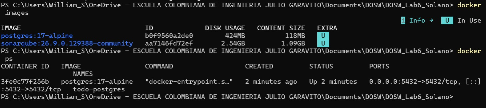

**Tabla `tasks`**

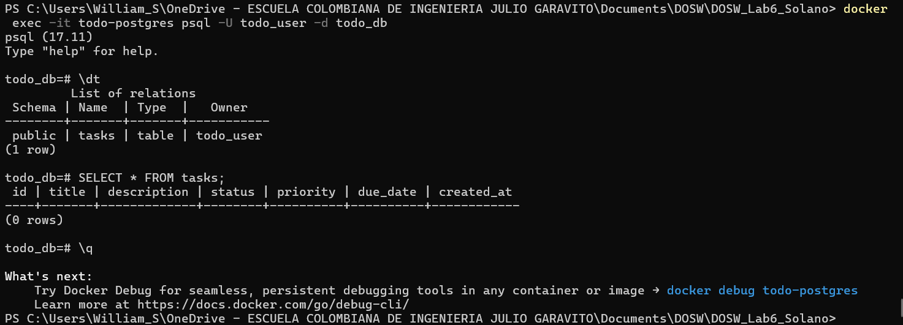

**Conexión de Spring Boot a PostgreSQL**

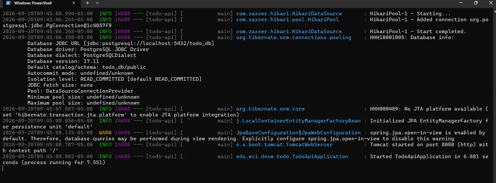

**API funcionando (CRUD completo, incluye 404 y 400)**

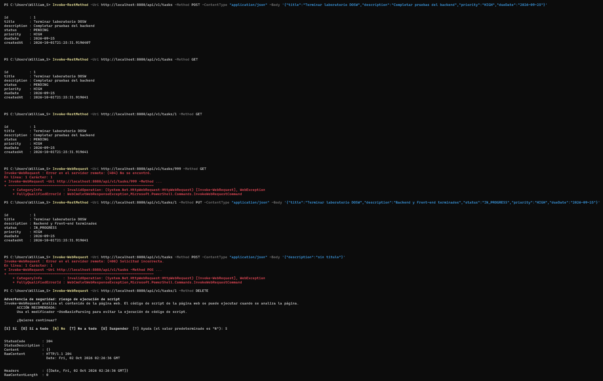

**Aplicación React y creación de tarea**

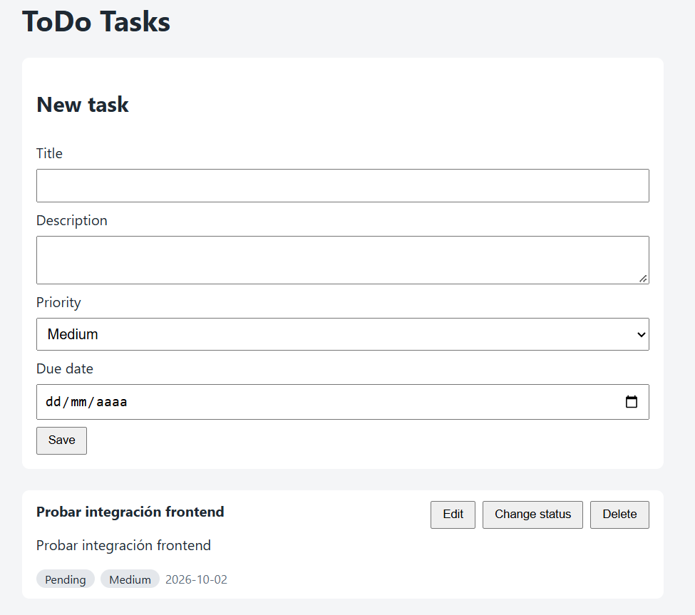

**Edición de tarea desde React**

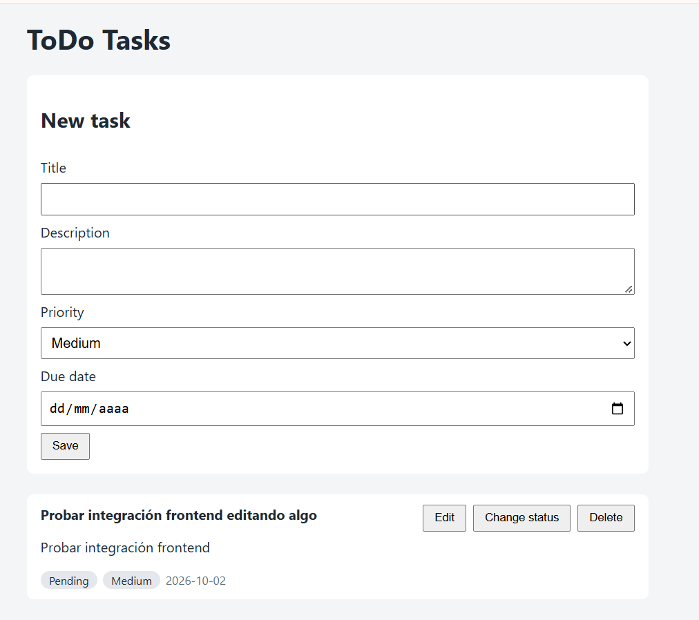

**Eliminación de tarea desde React**

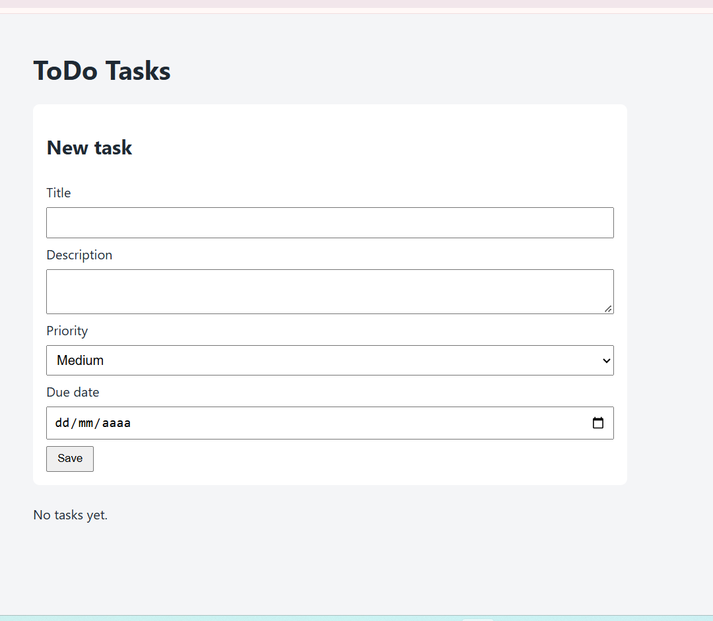

## 6. Resultados de las pruebas

**Pruebas del Service (JUnit + Mockito)**

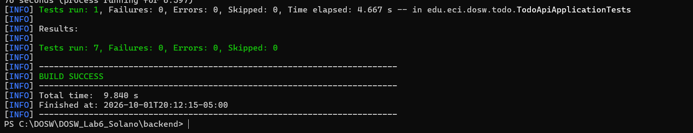

**Pruebas del Controller (MockMvc)**

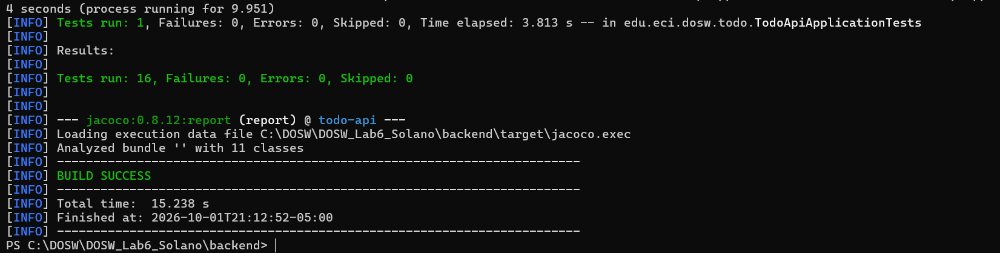

**Cobertura JaCoCo — 90% total, 100% en ramas de `service`**

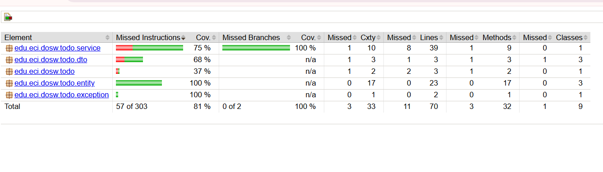

**Pruebas del Front-end (Vitest + React Testing Library)**

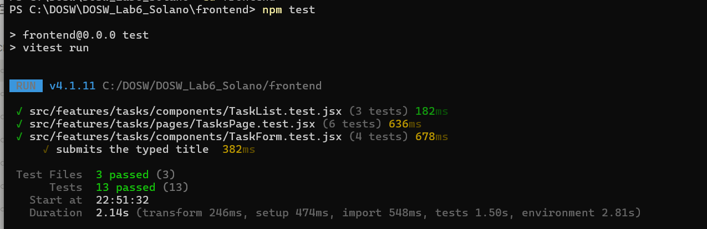

## 7. Respuestas a las preguntas de análisis

### Arquitectura

**1.** Al presionar "Guardar tarea", React llama a `createTask` de `taskApi.js`, que hace
un `fetch` POST a `/api/v1/tasks` con el JSON del formulario. Spring Boot recibe la
petición en `TaskController`, que valida el DTO (`@Valid`) y la pasa a `TaskServiceImpl`.
El service asigna los valores por defecto (`status=PENDING`, `priority=MEDIUM` si no
se envió, `createdAt`), convierte el DTO a `TaskEntity` y llama a `taskRepository.save()`.
Spring Data JPA, a través de Hibernate, genera el `INSERT` y lo ejecuta contra PostgreSQL.
La respuesta vuelve como `TaskResponse` con código `201`, y React actualiza la lista
llamando de nuevo a `loadTasks()`.

**2.**
- **Controller**: recibe peticiones HTTP, valida el formato de entrada y devuelve códigos de estado correctos.
- **Service**: contiene la lógica de negocio: valores por defecto, verificación de existencia, conversión Entity↔DTO.
- **Repository**: abstrae el acceso a la base de datos mediante `JpaRepository`.
- **Entity**: representa la tabla `tasks` y su mapeo con JPA.
- **DTO**: define qué datos puede enviar o recibir el cliente, sin exponer la entidad directamente.

**3.** El Front-end no se conecta directamente a PostgreSQL porque no tiene (ni debe tener)
credenciales de base de datos, y porque toda la lógica de negocio y validación vive en
el backend. Conectar el navegador directamente a la base de datos sería un riesgo de
seguridad grave y rompería la separación de responsabilidades.

**4.** Si el Controller accediera directamente al Repository e implementara ahí la lógica
de negocio, se perdería la separación de capas: el código sería difícil de probar
(las pruebas del Controller necesitarían una base de datos real), difícil de reutilizar,
y cualquier cambio en las reglas de negocio implicaría tocar la capa HTTP.

### Persistencia

**5.** `TaskEntity` usa `@Entity` y `@Table(name = "tasks")` para mapearse a la tabla, y
cada atributo usa `@Column` para mapearse a su columna correspondiente (por ejemplo,
`dueDate` → `due_date`). Los enums `status` y `priority` usan `@Enumerated(EnumType.STRING)`
para guardarse como texto, igual que lo definen las restricciones `CHECK` de la tabla.

**6.** JPA es la especificación que define cómo mapear objetos Java a tablas relacionales.
Hibernate es la implementación que realmente traduce las operaciones a SQL y las ejecuta.
Spring Data JPA es la capa que simplifica el uso de JPA/Hibernate en Spring, generando
automáticamente repositorios como `TaskRepository` sin necesidad de escribir SQL manual.

**7.** `JpaRepository` provee, sin implementarlos manualmente: `save()`, `findById()`,
`findAll()`, `deleteById()`/`delete()`, `existsById()`, `count()`, entre otros.

**8.** Se usó `ddl-auto=validate` en lugar de `update` o `create` porque el esquema de la
base de datos ya está controlado por el script `001_create_schema.sql`, que define
restricciones (`CHECK`, `NOT NULL`, valores por defecto) que Hibernate no replicaría
exactamente si generara el esquema automáticamente. `validate` solo confirma que la
entidad coincide con la tabla real, sin modificarla, evitando que un cambio accidental
en el código altere la estructura de la base de datos.

### API REST

**9.**
- Crear → `POST`: crea un nuevo recurso.
- Consultar → `GET`: operación de solo lectura, sin efectos secundarios.
- Actualizar → `PUT`: reemplaza el recurso existente con los datos enviados.
- Eliminar → `DELETE`: elimina el recurso identificado por su id.

**10.**
- `200 OK`: la petición se procesó correctamente y hay un cuerpo de respuesta (GET, PUT exitosos).
- `201 Created`: se creó un nuevo recurso (POST exitoso).
- `204 No Content`: la operación fue exitosa pero no hay nada que devolver (DELETE exitoso).
- `400 Bad Request`: los datos enviados por el cliente son inválidos (falla de validación).
- `404 Not Found`: el recurso solicitado no existe.
- `500 Internal Server Error`: error no controlado del servidor, no causado por el cliente.

**11.** React y Spring Boot intercambian datos en formato **JSON**. El frontend envía el
cuerpo de las peticiones serializado como JSON (vía `fetch` con `Content-Type: application/json`)
y el backend responde también en JSON, serializando los DTOs automáticamente con Jackson.

### React

**12.** `taskApi.js` centraliza toda la comunicación HTTP con el backend: define las
funciones `getTasks`, `getTask`, `createTask`, `updateTask` y `deleteTask`, y maneja
los errores de respuesta en un único lugar (`handleResponse`), para que el resto de
la aplicación no tenga que repetir lógica de `fetch`.

**13.** `useState` se usó para guardar el estado local de los componentes: la lista de
tareas, si está cargando, si hay un error, y qué tarea se está editando en el formulario.

**14.** `useEffect` se usó en `useTasks` para cargar las tareas automáticamente la
primera vez que se monta el componente, sin que el usuario tenga que pedirlo manualmente.

**15.** Después de crear, editar o eliminar una tarea, el hook `useTasks` vuelve a llamar
a `loadTasks()`, que trae la lista actualizada desde el backend y actualiza el estado
con `setTasks`. Como React re-renderiza automáticamente cuando el estado cambia, la
pantalla se actualiza sola, sin recargar la página.

### Docker y PostgreSQL

**16.** Usar la imagen oficial evita instalar y configurar PostgreSQL manualmente en
cada máquina del equipo, garantiza que todos usen exactamente la misma versión, y
permite levantar o destruir el entorno de base de datos en segundos sin afectar el
sistema operativo del computador.

**17.**
- `docker pull`: descarga una imagen desde un registro (como Docker Hub) sin ejecutarla.
- `docker run`: crea y arranca un contenedor nuevo a partir de una imagen.
- `docker stop`: detiene un contenedor en ejecución sin eliminarlo.
- `docker start`: vuelve a iniciar un contenedor que ya existe pero está detenido.
- `docker exec`: ejecuta un comando dentro de un contenedor que ya está corriendo.

**18.** Se usó un volumen Docker para que los datos de PostgreSQL persistan fuera del
ciclo de vida del contenedor. Sin volumen, al eliminar el contenedor se perdería toda
la información almacenada.

**19.** Si se elimina el contenedor pero se conserva el volumen, la información se
mantiene intacta, porque los datos reales viven en el volumen, no en el contenedor.
Al crear un nuevo contenedor apuntando al mismo volumen, los datos vuelven a estar disponibles.

### Pruebas

**20.** Las pruebas unitarias del Service no deben depender de PostgreSQL real porque
eso las haría lentas, frágiles (dependen de que la base esté disponible y en un estado
conocido) y dejarían de ser pruebas "unitarias" para convertirse en pruebas de integración.
Al simular el Repository, se prueba solo la lógica del Service de forma aislada y rápida.

**21.** Se simuló `TaskRepository` con `@Mock`, para controlar exactamente qué devuelve
(`findById`, `save`, etc.) sin tocar una base de datos real, y poder probar casos como
"tarea no encontrada" de forma determinista.

**22.** En `TaskControllerTest` se simuló `TaskService` con `@MockBean`, para probar
solo la capa HTTP (códigos de estado, formato de las respuestas) sin ejecutar la
lógica de negocio real ni tocar la base de datos.

**23.** Durante el desarrollo, al hacer un merge entre ramas la carpeta `backend` quedó
incompleta (faltaban `pom.xml`, `mvnw` y la estructura de `src/main`), lo cual se detectó
porque `./mvnw compile` fallaba con errores de "cannot find symbol" en clases que sí
existían en el código. Se corrigió restaurando esos archivos desde la rama que sí tenía
la estructura completa (`git restore --source=...`) y confirmando con una nueva compilación
exitosa antes de continuar.

**24.** JaCoCo indica qué porcentaje de líneas y ramas del código fueron ejecutadas por
las pruebas. Un porcentaje alto no garantiza buenas pruebas porque solo mide que el
código se ejecutó, no que los resultados se hayan verificado correctamente — se puede
tener 100% de cobertura con pruebas que no hacen ningún `assert` significativo.

### Integración

**25.**
```
React
   ↓ (fetch, JSON sobre HTTP)
API REST (Controller)
   ↓ (llamada a método Java)
Service
   ↓ (llamada a método Java)
Repository
   ↓ (JPQL/SQL generado)
JPA / Hibernate
   ↓ (JDBC)
PostgreSQL
```
React envía peticiones HTTP al Controller, que delega en el Service la lógica de
negocio. El Service usa el Repository para acceder a los datos, y JPA/Hibernate
traducen esas llamadas a sentencias SQL que finalmente se ejecutan contra PostgreSQL
a través del driver JDBC. La respuesta recorre el camino inverso hasta volver a React
como JSON.

## 8. Video de demostración

https://pruebacorreoescuelaingeduco-my.sharepoint.com/:v:/g/personal/paula_solano-m_mail_escuelaing_edu_co/IQC1MPfsVlkNTLl-6-vkmKGoAdUei3HlSeFSlWChDZ4nqoM?nav=eyJyZWZlcnJhbEluZm8iOnsicmVmZXJyYWxBcHAiOiJPbmVEcml2ZUZvckJ1c2luZXNzIiwicmVmZXJyYWxBcHBQbGF0Zm9ybSI6IldlYiIsInJlZmVycmFsTW9kZSI6InZpZXciLCJyZWZlcnJhbFZpZXciOiJNeUZpbGVzTGlua0NvcHkifX0&e=1xKuJi
